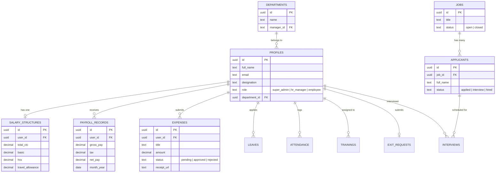

# 🖼️ Database Schema & ER Diagram - Zen HRMS

This document provides a visualization and detailed description of the Zen HRMS data architecture.

---

## 📊 Entity Relationship Diagram (ERD)

---

## 🏛️ Core Tables

### 👤 Profiles
The central entity representing an employee. Linked to Auth users and departments.
- **Security**: Row Level Security (RLS) ensures users can only view their own profile unless they are an Admin.

### 💼 Salary Structures
Detailed CTC breakdowns for each employee, used to calculate monthly disbursements.
- **Relational Integrity**: 1-to-1 mapping with `profiles(id)`.

### 💰 Payroll Records
Historical logs of salary payments, including tax deductions and net pay.

### 📝 Expense Claims
Reimbursement tracking for business-related expenditures with storage integration for receipts.

### 🤝 Recruitment (Jobs & Applicants)
Manage the hiring lifecycle from public job posting to final hiring status.

---

**Generated for Zen HRMS Technical Documentation.**
